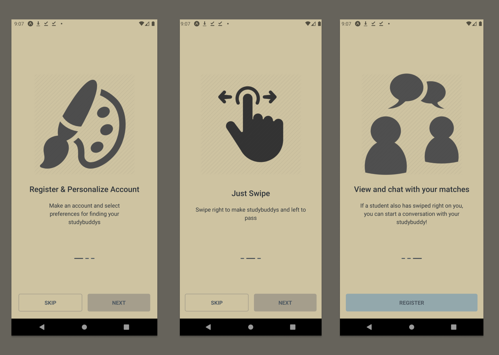

<div align="center">
  
</div>
<h1 align="center">
  StudyBuddy Mobile Application
</h1>

<p align="center">
  This is the implementation of the StudyBuddy Mobile Application Frontend developed using <a href="https://reactnative.dev/docs/getting-started" target="_blank">React Native</a> and <a href="https://docs.expo.dev/overview/">Expo</a>. For backend implementation, you can check the backend <a href="https://github.com/mastertimisensei/StudyBuddyBE.git">repository</a> For more information on StudyBuddy, the documentation is available <a href="https://github.com/aamnatayyab6/ELTE-IK-Thesis/blob/main/Documentation.pdf">here</a>.
</p>



## Want to see it in action? You can find the APK [here](https://github.com/aamnatayyab6/StudyBuddy_FE/tree/main/apk)

# Getting Started

## Requirements

- You project should build against Android 5.0 (API level 21) SDK at least.
- StudyBuddy works only with devices running Android 5.0 (API level 21) or higher.

## Installation

Install with [npm](https://www.npmjs.com/):

```sh
$ npm install
```

## Run

To run the app on the device or emulator:

```sh
$ npx expo start
```

## Building APK

- To build APK [EAS](https://docs.expo.dev/build/introduction/) is needed:

```sh
$ npm install -g eas-cli
```

- Log in to your Expo account:

```sh
$ eas login
```

- Create a configuration file:

```sh
$ eas build:configure
```

- Add preview:

```jsonl
{
  "preview": {
    "android": {
      "buildType": "apk"
    }
  }
}
```

- Run build:

```sh
$ eas build -p android --profile preview
```

### Developer

**Aamna Tayyab**

- [github/aamnatayyab6](https://github.com/aamnatayyab6)
- [linkedin](https://www.linkedin.com/in/aamna-tayyab-10465b1a0/)
